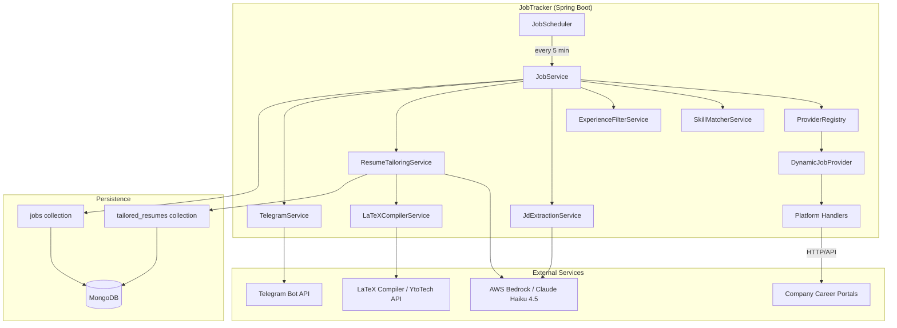

# JobTracker

**JobTracker** is an automated job discovery, matching, and resume tailoring system built for Java backend developer roles in India. It continuously monitors career portals at major companies, scores each posting against your candidate profile, sends rich Telegram alerts for strong matches, and generates ATS-optimized PDF resumes tailored to each job description.

The system is designed to minimize AI costs through a multi-stage filtering pipeline: cheap local checks run first, and AWS Bedrock (Claude Haiku 4.5) is only invoked for jobs that pass those gates.

---

## Table of Contents

- [Overview](#overview)
- [Key Features](#key-features)
- [How It Works](#how-it-works)
- [Architecture](#architecture)
- [Technology Stack](#technology-stack)
- [Supported Companies & Platforms](#supported-companies--platforms)
- [Data Models](#data-models)
- [Core Services](#core-services)
- [AI & Resume Pipeline](#ai--resume-pipeline)
- [Project Structure](#project-structure)
- [Quick Start](#quick-start)
- [Configuration](#configuration)
- [Deployment](#deployment)
- [Testing](#testing)
- [Cost Estimate](#cost-estimate)
- [Future Roadmap](#future-roadmap)
- [Documentation Index](#documentation-index)
- [Contributing](#contributing)
- [License](#license)

---

## Overview

JobTracker runs as a Spring Boot background service. Every 5 minutes (after an initial 10-second startup delay), a scheduled job cycle:

1. Fetches new job listings from configured company providers
2. Deduplicates against MongoDB
3. Applies title, experience, and skill filters (local, zero cost)
4. Uses Claude to extract structured data from promising job descriptions
5. Computes an AI match score with apply/skip recommendations
6. Sends a formatted Telegram alert
7. Generates and delivers a tailored or general resume PDF

All matched and skipped jobs are persisted in MongoDB for audit and analysis. Tailored resumes are stored with a 30-day TTL index for automatic cleanup.

---

## Key Features

| Feature | Description |
|---------|-------------|
| **Multi-platform scraping** | Oracle HCM, Workday, Microsoft Careers, Amazon Jobs, Goldman GraphQL, TalentBrew |
| **7 active providers** | American Express, JPMorgan, Barclays, Goldman Sachs, Microsoft, Visa, Amazon |
| **Tiered skill matching** | Weighted local scoring (Tier 1: 3×, Tier 2: 2×, Tier 3: 1×) before any AI call |
| **AI job analysis** | Structured JD extraction: skills, experience, salary, work mode, job level |
| **3-tier matching fallback** | AI scoring → structured matching → fuzzy local matching |
| **Iterative resume tailoring** | Up to 4 Claude iterations targeting ≥85% ATS score (v4.0) |
| **One-page PDF guarantee** | LaTeX template injection with content optimization |
| **Telegram delivery** | Rich HTML job alerts + PDF resume attachments |
| **Cost controls** | Mock AI mode for dev, local score threshold before Bedrock, score-based resume strategy |
| **Provider toggles** | Enable/disable individual companies via config |
| **Auto cleanup** | MongoDB TTL index deletes tailored resumes after 30 days |

---

## How It Works

### Job Processing Pipeline

```
┌─────────────────┐
│  JobScheduler   │  Every 5 min (fixedDelay), 10s initial delay
└────────┬────────┘
         │
         ▼
┌─────────────────┐
│   JobService    │  Iterates all enabled JobProviders
└────────┬────────┘
         │
         ▼
┌─────────────────────────────────────────────────────────────┐
│  Phase 1: Fetch & Filter (per provider)                     │
│  • fetchJobs() from platform handler                          │
│  • Skip if already in MongoDB (dedup by job ID)               │
│  • Title filter (ExperienceFilterService)                     │
│  • Parallel JD fetch (configurable threads + delay)           │
└────────┬────────────────────────────────────────────────────┘
         │
         ▼
┌─────────────────────────────────────────────────────────────┐
│  Phase 2: Local Scoring (zero AI cost)                      │
│  • Skip empty descriptions                                    │
│  • Regex experience filter                                    │
│  • SkillMatcherService weighted score                         │
│  • Skip if local score < min threshold (default 20%)          │
└────────┬────────────────────────────────────────────────────┘
         │
         ▼
┌─────────────────────────────────────────────────────────────┐
│  Phase 3: AI Analysis (AWS Bedrock)                         │
│  • JdExtractionService → structured fields                    │
│  • Structured experience filter                               │
│  • SkillMatcherService.matchStructured() → final score          │
└────────┬────────────────────────────────────────────────────┘
         │
         ▼
┌─────────────────────────────────────────────────────────────┐
│  Phase 4: Notify & Resume                                   │
│  • Save to MongoDB                                            │
│  • Telegram job alert (HTML formatted)                        │
│  • Score ≥ 50% → AI-tailored resume (ResumeTailoringService)  │
│  • Score < 50% → General resume (GeneralResumeService)        │
└─────────────────────────────────────────────────────────────┘
```

### Resume Tailoring Flow

```
Job (matched) → Load base LaTeX template (base_resume.tex)
              → Claude iterative loop (max 4, target ATS ≥ 85%)
              → Inject JSON content into LaTeX template
              → Compile PDF (local pdflatex → YtoTech API fallback)
              → Save to tailored_resumes collection
              → Send PDF via Telegram with ATS score caption
```

---

## Architecture

### High-Level System Diagram



### Design Patterns

| Pattern | Usage |
|---------|-------|
| **Strategy** | `PlatformHandler` interface with per-platform implementations (Oracle HCM, Workday, etc.) |
| **Registry / Factory** | `ProviderRegistry` builds `DynamicJobProvider` instances from `JobProviderConfig` |
| **Configuration-driven providers** | Adding an Oracle HCM company requires config only — no new handler code |
| **Pipeline / Filter chain** | Title → experience → local score → AI extraction → structured filter → match |
| **Fallback chain** | Local LaTeX → online API; AI tailoring → general resume; AI score → structured → fuzzy |
| **Cost gate** | `minLocalScoreForBedrock` prevents Bedrock calls on weak local matches |

### Layer Breakdown

```
┌──────────────────────────────────────────────────────────┐
│  Presentation     │  HealthController (/health)         │
├───────────────────┼──────────────────────────────────────┤
│  Scheduling       │  JobScheduler                       │
├───────────────────┼──────────────────────────────────────┤
│  Business Logic   │  JobService, SkillMatcherService,   │
│                   │  ExperienceFilterService,           │
│                   │  JdExtractionService,               │
│                   │  ResumeTailoringService,            │
│                   │  TelegramService, GeneralResumeService│
├───────────────────┼──────────────────────────────────────┤
│  Integration      │  DynamicJobProvider + PlatformHandlers│
├───────────────────┼──────────────────────────────────────┤
│  Persistence      │  JobRepository, TailoredResumeRepository│
├───────────────────┼──────────────────────────────────────┤
│  Configuration    │  BedrockConfig, MongoConfig,          │
│                   │  MongoIndexConfig, CandidateProfile,  │
│                   │  ProviderRegistry                     │
└──────────────────────────────────────────────────────────┘
```

### Concurrency Model

- **JD fetching**: Per-provider thread pool (`jdFetchThreads`, `jdFetchDelayMs`) with 2-minute await timeout
- **Resume tailoring**: Runs sequentially outside the JD executor to avoid thread interruption on long AI calls
- **MongoDB writes**: Synchronized on repository for deduplication safety; notifications sent outside the lock

---

## Technology Stack

| Layer | Technology |
|-------|------------|
| Language | Java 17 |
| Framework | Spring Boot 4.0.5 |
| Database | MongoDB (Spring Data MongoDB) |
| AI | AWS Bedrock Runtime — Claude Haiku 4.5 |
| HTML parsing | Jsoup 1.17.2 |
| PDF generation | LaTeX (TeX Live / pdflatex) + YtoTech API fallback |
| Notifications | Telegram Bot API |
| Build | Maven 3.9.6 (wrapper included) |
| Containerization | Docker (multi-stage build with TeX Live) |
| CI/CD | GitHub Actions → Render verification + Telegram alerts |

---

## Supported Companies & Platforms

| Company | Platform | JD Fetch | Notes |
|---------|----------|----------|-------|
| American Express | Oracle HCM | 3 threads, 300ms delay | India + Technology facet filters |
| JPMorgan Chase | Oracle HCM | 3 threads, 300ms delay | Category + location facets |
| Barclays | TalentBrew | 3 threads, 300ms delay | HTML embedded in JSON |
| Goldman Sachs | GraphQL API | 3 threads, 300ms delay | Custom higher.gs.com API |
| Microsoft | Microsoft Careers | 1 thread, 10s delay | Strict rate limiting |
| Visa | Workday | 2 threads, 500ms delay | Facet-based India filter |
| Amazon | Amazon Jobs | No separate fetch | Full JD in search response |

Each provider can be toggled independently:

```properties
provider.microsoft.enabled=true
provider.amazon.enabled=true
provider.amex.enabled=true
provider.jpmorgan.enabled=true
provider.barclays.enabled=true
provider.goldman.enabled=true
provider.visa.enabled=true
```

---

## Data Models

### `Job` (collection: `jobs`)

Stores every job seen — matched or skipped — with full audit trail.

| Field Group | Key Fields |
|-------------|------------|
| Identity | `id`, `externalId`, `title`, `company`, `url` |
| Content | `description`, `skills`, `responsibilities`, `qualifications` |
| Scoring | `matchScore`, `localMatchScore`, `aiMatchScore`, `matchedSkills`, `missingSkills` |
| Structured (AI) | `minExperienceRequired`, `maxExperienceRequired`, `requiredSkills`, `jobLevel`, `workMode`, `salaryMin/Max` |
| Recommendations | `applyRecommendation`, `scoreReason` |
| Audit | `skipped`, `skipReason`, `aiAnalyzed`, `firstSeenAt`, `postedAt` |

### `TailoredResume` (collection: `tailored_resumes`)

| Field | Description |
|-------|-------------|
| `jobId` | Links to matched job |
| `latexSource` | Generated LaTeX document |
| `pdfBytes` | Compiled PDF binary |
| `atsScore` | AI-estimated ATS compatibility (0–100) |
| `atsReasoning` | Explanation of score |
| `claudePromptVersion` | e.g. `4.0-iterative-85` |
| `tailoredAt` | TTL index field — auto-deleted after 30 days |

---

## Core Services

| Service | Responsibility |
|---------|----------------|
| `JobService` | Orchestrates the full job check cycle, filtering, persistence, and notifications |
| `SkillMatcherService` | Tiered weighted skill matching (local + structured modes) |
| `ExperienceFilterService` | Title regex + JD experience parsing + structured experience validation |
| `JdExtractionService` | Claude-powered structured extraction from job descriptions |
| `ResumeTailoringService` | Iterative ATS optimization loop, LaTeX injection, PDF generation |
| `LaTeXCompilerService` | Local `pdflatex` with YtoTech API fallback |
| `TelegramService` | Sends job alerts and resume PDF attachments |
| `GeneralResumeService` | Delivers a static general resume for lower-scoring matches |

---

## AI & Resume Pipeline

### Job Analysis (JdExtractionService)

- **Prompt version**: 2.0
- **Input**: Truncated JD (max 8,000 chars ≈ 2,000 tokens)
- **Output**: Experience range, skills (required/preferred/nice-to-have), job level, work mode, salary, responsibilities
- **Dev mode**: Mock responses when `AI_DEV_MOCK_ENABLED=true`

### Resume Tailoring (ResumeTailoringService)

- **Prompt version**: 4.0-iterative-85
- **Target ATS score**: ≥ 85%
- **Max iterations**: 4 (with exponential backoff on API errors)
- **Strategy**: Sends content JSON only — not the full LaTeX template (token optimization)
- **Base template**: `src/main/resources/resume/base_resume.tex`

### Cost-Aware Resume Strategy

| AI Match Score | Action | Approx. Cost |
|----------------|--------|--------------|
| ≥ 50% | AI-tailored resume (iterative) | ~$0.004/job |
| < 50% | General resume (no AI) | $0 |
| Failed tailoring | Fallback to general resume | $0 |

---

## Project Structure

```
JobTracker/
├── src/main/java/com/jobtracker/jobtracker/
│   ├── JobtrackerApplication.java       # Entry point, scheduling enabled
│   ├── config/
│   │   ├── BedrockConfig.java           # AWS Bedrock client
│   │   ├── CandidateProfile.java        # Candidate skills, experience, contact
│   │   ├── MongoConfig.java             # MongoDB connection
│   │   └── MongoIndexConfig.java        # TTL index for tailored resumes
│   ├── controller/
│   │   └── HealthController.java        # GET /health
│   ├── model/
│   │   ├── Job.java                     # Job domain model
│   │   ├── TailoredResume.java          # Resume domain model
│   │   └── WorkMode.java                # REMOTE, HYBRID, ONSITE, etc.
│   ├── repository/
│   │   ├── JobRepository.java
│   │   └── TailoredResumeRepository.java
│   ├── scheduler/
│   │   └── JobScheduler.java            # 5-minute fixed-delay cycle
│   ├── service/
│   │   ├── JobService.java              # Main orchestrator
│   │   ├── SkillMatcherService.java
│   │   ├── ExperienceFilterService.java
│   │   ├── JdExtractionService.java
│   │   ├── ResumeTailoringService.java
│   │   ├── LaTeXCompilerService.java
│   │   ├── LocalLaTeXCompilerService.java
│   │   ├── TelegramService.java
│   │   └── GeneralResumeService.java
│   └── provider/
│       ├── JobProvider.java             # Provider interface
│       ├── DynamicJobProvider.java      # Config-driven provider
│       ├── config/
│       │   ├── Platform.java            # Platform enum
│       │   ├── JobProviderConfig.java   # Provider configuration builder
│       │   └── ProviderRegistry.java    # Registers all company providers
│       └── platform/
│           ├── PlatformHandler.java     # Handler interface
│           ├── OracleHcmPlatformHandler.java
│           ├── WorkdayPlatformHandler.java
│           ├── MicrosoftPlatformHandler.java
│           ├── AmazonPlatformHandler.java
│           ├── BarclaysPlatformHandler.java
│           └── GoldmanSachsPlatformHandler.java
├── src/main/resources/
│   ├── application.properties           # Base config + env var defaults
│   ├── application-dev.properties       # Local dev (mock AI enabled)
│   ├── application-prod.properties      # Production settings
│   └── resume/
│       └── base_resume.tex              # LaTeX resume template
├── src/test/java/                       # Spring Boot tests
├── .github/workflows/deploy.yml         # Verify Render deploy + Telegram notify
├── Dockerfile                           # Multi-stage build with TeX Live
├── .env.example                         # Environment variable template
├── pom.xml                              # Maven dependencies
└── docs/                                # See Documentation Index below
```

---

## Quick Start

### Prerequisites

| Requirement | Notes |
|-------------|-------|
| **Java 17+** | Required to run the app |
| **Maven** | Use included wrapper: `./mvnw` |
| **MongoDB** | Must be running before startup |
| **Telegram bot** | Bot token + chat ID for notifications |
| **AWS Bedrock** | Optional locally — mock AI enabled by default in dev |

Optional for resume PDF generation:
- **TeX Live** (`pdflatex`) for local compilation, or use the online YtoTech fallback

### 1. Clone and configure

```bash
git clone https://github.com/Shariq-ah/JobTracker.git
cd JobTracker
cp .env.example .env.local
# Edit .env.local with your Telegram credentials
export $(grep -v '^#' .env.local | xargs)
```

**Minimum required:**

```bash
export TELEGRAM_BOT_TOKEN="your_bot_token"
export TELEGRAM_CHAT_ID="your_chat_id"
```

### 2. Start MongoDB

```bash
docker run -d -p 27017:27017 --name mongodb mongo:latest
```

Default connection: `mongodb://localhost:27017/jobtracker`

### 3. Build and run

```bash
./mvnw clean install
./mvnw spring-boot:run -Dspring-boot.run.profiles=dev
```

### 4. Verify

```bash
curl http://localhost:8080/health
# Expected: JobTracker is running
```

On startup you should see:

```
========== JobTracker STARTED at ... ==========
```

The scheduler waits **10 seconds**, then runs job checks every **5 minutes** after each cycle completes.

### Profiles

| Profile | Use Case | Config File |
|---------|----------|-------------|
| **dev** | Local development (mock AI default) | `application-dev.properties` |
| **prod** | Production, Docker, EC2, Render | `application-prod.properties` |
| *(default)* | Env var fallbacks | `application.properties` |

### Local dev without AWS costs

Dev profile enables mock AI by default (`AI_DEV_MOCK_ENABLED=true`).

To use real AI scoring locally:

```bash
export AI_DEV_MOCK_ENABLED=false
export AWS_ACCESS_KEY_ID="your_access_key"
export AWS_SECRET_ACCESS_KEY="your_secret_key"
```

### Trigger immediate job check (optional)

Uncomment a `CommandLineRunner` bean in `JobtrackerApplication.java` to run a scan on startup.

---

## Configuration

### Environment Variables

| Variable | Description | Required | Default |
|----------|-------------|----------|---------|
| `TELEGRAM_BOT_TOKEN` | Telegram bot token | Yes | — |
| `TELEGRAM_CHAT_ID` | Telegram chat ID | Yes | — |
| `MONGO_URI` | MongoDB connection string | Yes | `mongodb://localhost:27017/jobtracker` |
| `AWS_ACCESS_KEY_ID` | AWS access key | Prod only | — |
| `AWS_SECRET_ACCESS_KEY` | AWS secret key | Prod only | — |
| `AWS_BEDROCK_REGION` | AWS region | No | `us-east-1` |
| `AWS_BEDROCK_MODEL_ID` | Claude model ID | No | `us.anthropic.claude-haiku-4-5-20251001-v1:0` |
| `AWS_BEDROCK_MAX_TOKENS` | Max response tokens | No | `3000` |
| `AI_DEV_MOCK_ENABLED` | Mock AI instead of Bedrock | No | `true` (dev) |
| `AI_BEDROCK_ENABLED` | Enable/disable Bedrock scoring | No | `true` |
| `AI_BEDROCK_MIN_LOCAL_SCORE` | Min local score before Bedrock | No | `20` |
| `RESUME_TAILORING_ENABLED` | Enable AI resume tailoring | No | `true` |
| `LATEX_LOCAL_ENABLED` | Compile PDFs locally | No | `true` |
| `PROVIDER_*_ENABLED` | Toggle individual providers | No | `true` |

See `.env.example` for the full template.

### Candidate Profile

Edit in `application-dev.properties` or `application-prod.properties`:

```properties
candidate.name=Your Name
candidate.skills=Java,Spring Boot,Microservices,REST API,Kafka,SQL
candidate.experience=3
candidate.roles=Software Engineer,Backend Engineer,Java Developer
candidate.email=you@example.com
candidate.linkedin=https://linkedin.com/in/yourprofile
```

---

## Deployment

### Docker

```bash
docker build -t jobtracker:latest .

docker run -d \
  -p 8080:8080 \
  -e MONGO_URI="mongodb://host.docker.internal:27017/jobtracker" \
  -e TELEGRAM_BOT_TOKEN="your_token" \
  -e TELEGRAM_CHAT_ID="your_chat_id" \
  -e AWS_ACCESS_KEY_ID="your_access_key" \
  -e AWS_SECRET_ACCESS_KEY="your_secret_key" \
  --name jobtracker \
  jobtracker:latest
```

The Docker image uses the **prod** profile and includes TeX Live for local PDF compilation.

### GitHub Actions → Render verification

On push to `main`, `.github/workflows/deploy.yml` builds the app, waits for Render to serve the new commit, and sends a Telegram notification on success or failure.

Required GitHub secrets:

| Secret | Example |
|--------|---------|
| `RENDER_HEALTH_URL` | `https://your-app.onrender.com/health` |
| `TELEGRAM_BOT_TOKEN` | Same bot token used in Render |
| `TELEGRAM_CHAT_ID` | Same chat ID used in Render |

Render sets `RENDER_GIT_COMMIT` automatically; the `/health` endpoint exposes the deployed commit so CI can verify the new version is live.

### Render.com

1. Create a new Web Service and connect the repository
2. **Build Command**: `./mvnw clean install -DskipTests`
3. **Start Command**: `java -jar target/jobtracker-0.0.1-SNAPSHOT.jar --spring.profiles.active=prod`
4. Set environment variables (see [Configuration](#configuration))

See `RENDER_DEPLOYMENT.md` for detailed Render setup.

### Health Check

```bash
curl http://localhost:8080/health
# Response: "JobTracker is running"
```

---

## Testing

| Script | Purpose |
|--------|---------|
| `./test_v4.0.sh` | End-to-end v4.0 iterative ATS tests |
| `./test-workday-api.sh` | Workday API integration tests |
| `./test-latex.sh` | LaTeX compilation tests |
| `./test_latex_escaping.sh` | LaTeX special character escaping |

Run unit tests:

```bash
./mvnw test
```

See `QUICK_START_TESTING.md` and `DEV_MODE_GUIDE.md` for detailed testing workflows.

---

## Cost Estimate

### Current (7 companies, ~75 jobs/month)

| Component | Monthly Cost |
|-----------|-------------|
| AWS Bedrock (JD extraction + tailoring) | ~$0.95 |
| MongoDB Atlas (free tier) | $0 |
| EC2 / Render | ~$2.00 |
| **Total** | **~$2.95/month** |

### At scale (27 companies, ~150 jobs/month)

| Component | Monthly Cost |
|-----------|-------------|
| AI (extraction + tailoring) | ~$1.92 |
| Infrastructure | ~$2.00 |
| **Total** | **~$3.92/month** |

See `MONTHLY_COST_ANALYSIS.md` and `COST_SCALING_20_COMPANIES.md` for detailed breakdowns.

---

## Future Roadmap

### Phase 1 — Scale Providers (Near Term)

- [ ] Add 5 high-value companies: Google, Meta, Adobe, Salesforce, Oracle
- [ ] Document Workday facet discovery workflow (`WORKDAY_FACET_FINDER.md`)
- [ ] Create `PROVIDERS.md` registry for all company configs and facet IDs
- [ ] Provider health monitoring and automatic disable on repeated failures

### Phase 2 — Expand Coverage (Medium Term)

- [ ] Add 10 more companies: SAP, VMware, Atlassian, Netflix, Intuit, Morgan Stanley, Citi, HSBC, Uber, PayPal
- [ ] Support additional platform types (Greenhouse, Lever, iCIMS)
- [ ] Configurable search keywords per provider (beyond hardcoded "Java")
- [ ] Multi-location support (US, UK, remote-global)

### Phase 3 — Intelligence & UX (Medium Term)

- [ ] Web dashboard for job history, match analytics, and apply tracking
- [ ] Application status tracking (applied, interview, rejected)
- [ ] Weekly digest Telegram summary
- [ ] Smarter cost controls: dynamic Bedrock threshold based on provider quality
- [ ] A/B testing for resume prompt versions

### Phase 4 — Resume & ATS (Ongoing)

- [x] Iterative ATS improvement loop (v4.0 — target ≥85%)
- [x] Enhanced base resume with full-stack visibility (v4.1)
- [ ] Resume version history and rollback
- [ ] Cover letter generation per job
- [ ] LinkedIn profile sync for skills/experience updates

### Phase 5 — Infrastructure (Long Term)

- [ ] Kubernetes deployment with horizontal scaling
- [ ] Redis cache for JD deduplication and rate-limit state
- [ ] Prometheus + Grafana observability (metrics, alert on provider failures)
- [ ] Multi-user support with per-user candidate profiles
- [ ] REST API for external integrations (mobile app, browser extension)

### Phase 6 — Advanced Matching

- [ ] Embedding-based semantic job matching (beyond keyword tiers)
- [ ] Company culture/fit scoring
- [ ] Salary benchmarking against market data
- [ ] Auto-apply integration for supported platforms (with user approval)

---

## Documentation Index

| Document | Description |
|----------|-------------|
| `DEV_MODE_GUIDE.md` | Zero-cost local development with mock AI |
| `QUICK_START_TESTING.md` | Testing workflows and scripts |
| `RENDER_DEPLOYMENT.md` | Render.com deployment guide |
| `ADD_WORKDAY_COMPANIES.md` | Adding new Workday-based companies |
| `WORKDAY_FACET_FINDER.md` | Discovering Workday facet IDs |
| `WORKDAY_COMPANIES_TEMPLATE.md` | Template for Workday provider config |
| `MONGODB_TTL_SETUP.md` | Automatic resume cleanup (30-day TTL) |
| `MONTHLY_COST_ANALYSIS.md` | Detailed AI and infra cost breakdown |
| `COST_SCALING_20_COMPANIES.md` | Cost projections for 27 companies |
| `IMPLEMENTATION_PLAN_V4.0.md` | Iterative ATS improvement design |
| `RESUME_ENHANCEMENT_V4.1.md` | Base resume content improvements |
| `ITERATIVE_ATS_IMPROVEMENT.md` | ATS scoring iteration details |
| `ONE_PAGE_GUARANTEE.md` | One-page resume optimization |
| `TEST_LATEX_LOCALLY.md` | Local LaTeX compilation setup |

---

## Security Notes

- Never commit `.env.local` or real credentials to Git
- All secrets loaded via environment variables
- `.env.example` provides a template without actual values
- `application-*.properties` use `${ENV_VAR}` substitution — no hardcoded secrets in prod

---

## Contributing

1. Fork the repository
2. Create a feature branch: `git checkout -b feature/your-feature`
3. Commit your changes with a clear message
4. Push to the branch: `git push origin feature/your-feature`
5. Open a Pull Request

---

## License

Personal project for job hunting automation. Not licensed for commercial use.

---

## Support

For issues or questions, open an issue on [GitHub](https://github.com/Shariq-ah/JobTracker/issues).

---

**Built for automating the job hunt — discover, match, tailor, and apply faster.**
